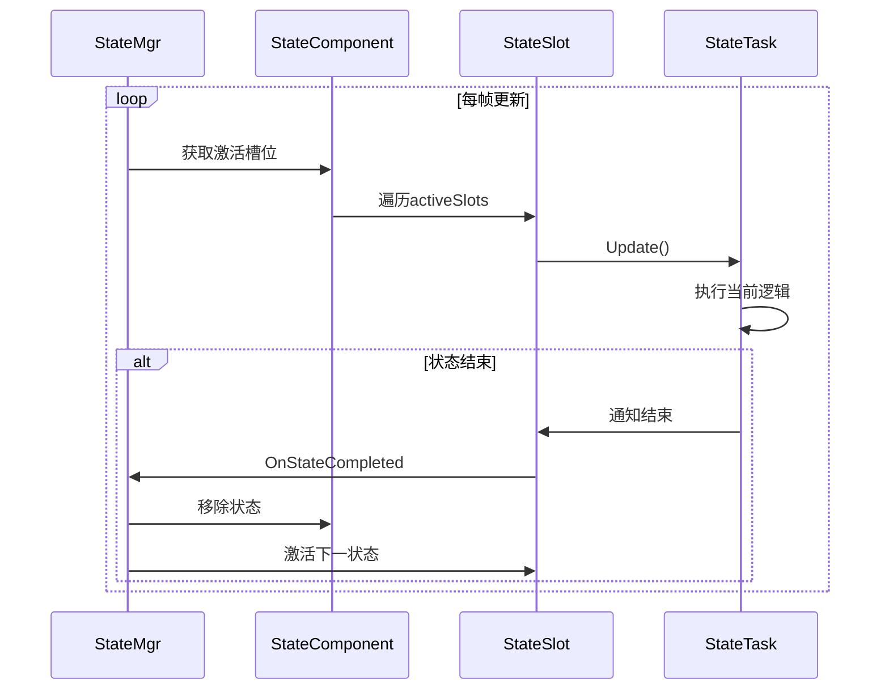
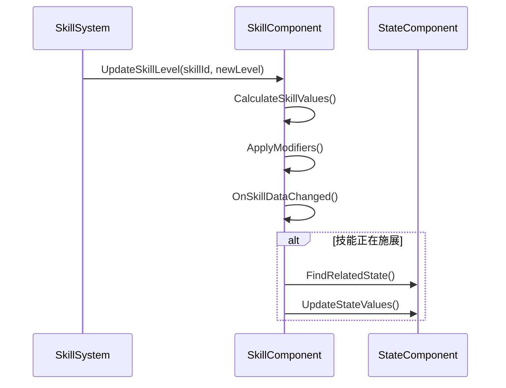

# 一、基础框架设计

## 1.1 GameObject设计

```csharp
// 游戏对象类型枚举
public enum GameObjectType {
    Player,
    NPC,
    Monster,
    Bullet,
    // ...
}
// 游戏对象
public class GameObject {
    public long instId; // 实例ID
    public int cid; // 配置ID
    
    // 组件管理
    private List<IComponent> components = new List<IComponent>();
    
    // 组件操作接口
    public T GetComponent<T>() where T : IComponent { /*...*/ }
    public void AddComponent<T>(T comp) where T : IComponent { /*...*/ }
    public void RemoveComponent<T>(T comp) where T : IComponent { /*...*/ }
    
    // 类型系统
    public GameObjectType type;
    public List<int> tags = new List<int>();
}
```

## 1.2 组件基类设计

```csharp
// 组件接口
public interface IComponent {
    void Init(GameObject gobj);
    void Start();
    void Update();
    void Stop();
}

// 数据组件标记接口
public interface IDataComponent : IComponent {}

// 行为组件标记接口
public interface IBehaviorComponent : IComponent {}
```


# 二、状态管理模块

## 2.1 状态基类

```csharp
public class State {
    public StateCfg cfg; // 状态配置
    public int level; // 等级
    public int stack; // 叠层
    public int timeLeft; // 剩余时间
    public Blackboard blackboard; // 动态数据
    public TaskEntry<Blackboard> task; // 关联的行为树/任务树
    public StateSlot slot; // 绑定的状态槽
    public bool active; // 是否激活
    public List<double> values = new List<double>(); // 状态数值
}
```

## 2.2 状态槽类

```csharp
public class StateSlot {
    public int id; // 槽位ID
    public State state; // 当前状态
    public TaskEntry task; // 缓存的任务
    public bool IsStatic => id <= 5; // 静态槽判断
}
```

## 2.3 状态组件

```csharp
public class StateComponent : IDataComponent {
    // 状态槽管理
    public List<StateSlot> slots = new List<StateSlot>(); // 按槽ID排序
    public List<StateSlot> activeSlots = new List<StateSlot>(); // 按激活顺序排序
    public List<State> states = new List<State>(); // 所有状态
    // 缓存结构
    private Dictionary<int, List<State>> cid2States = new Dictionary<int, List<State>>(); // configId -> List<State>
    private List<State>[] typeTag2States; // typeTag -> List<State>，tag即下标
    // 状态免疫管理
    public Dictionary<int,int> immuneStateTags = new (); // 免疫指定类型状态 - value为计数
    public Dictionary<int,int> immuneStateCids = new (); // 指定免疫的状态cid
    public Dictionary<int,int> nonimmuneStateCids = new (); // 指定排除的状态cid -- 不免疫的优先级更高，通常是为了支持特殊机制
}
```

## 2.4 状态配置

```csharp
// 状态配置
public class StateCfg {
    // Meta
    public int id; // 配置id
    public int category; // 种类：技能、Buff、其它
    public List<int> typeTags; // 类型标签，buff、debuff、出血、冰冻、破防...
    public List<int> funcTags; // 功能标签，禁止移动，禁止施法...
    // 数值
    public int lv; // 默认等级
    public int duration; // 持续时间    
    public int stack; // 默认叠层
    public int maxStack; // 最大叠加数
    // 状态互斥
    public int slot; // 绑定的静态槽，大于0有效
    public List<int> graphStateIds; // 互斥图重定向
    public int sameCasterPolicy; // 同施法者之间的互斥策略，丢弃旧的、丢弃新的、叠层刷新...
    public int diffCasterPolicy; // 不同施法者之间的互斥策略，并行、丢弃旧的、丢弃新的...
    // 状态免疫
    public List<int> immuneAttrs; // 角色身上存在以下任意属性时，不可添加该状态
    // 净化/驱散
    public bool allowDispel; // 允许驱散
    public bool alloPurify; // 允许净化
    // ...
    public string taskName; // 脚本名字--我用的是行为树
}
```

## 2.5 状态管理器

```csharp
public class StateMgr {
    // 状态组件的生命周期
    public void Init(GameObject gobj) {}
    public void Start(GameObject gobj) {}
    public void Update(GameObject gobj) {}
    public void Stop(GameObject gobj) {}
    // 挂起和恢复
    public void HangUp(GameObject gobj, State state, int timeout=0) {}
    public void Active(GameObject gobj, State state) {}
    // 功能扩展
    public void AddMergeHandler(int cid, StateMergeHandler handler) {}
    public void SetSlotHandler(int slot, StateSlotHandler handler) {}    
    public void AddCategoryHandler(int category, StateCategoryHandler handler) {}
    
    // 增删
    public bool TestAdd(GameObject gobj, State state);        
    public Result AddState(GameObject gobj, State state) {}
    public Result RemoveState(GameObject gobj, State state) {}
    public Result RemoveStates(GameObject gobj, List<State> states) {}
    // 根据cid的查询
    public State GetState(GameObject gobj, int cid) {}
    public List<State> GetStates(GameObject gobj, int cid) {}
    // 根据类型标签查询
    public List<State> FindStateByTag(GameObject gobj, int typeTag) {}
    public List<State> FindStateByTag(GameObject gobj, List<int> typeTags) {}
    // 特殊查询
    public List<State> FindState(GameObject gobj, Predicate<State> predicate) {}        
    public bool InState(GameObject gobj, int cid) {}
    public bool InTypeState(GameObject gobj, int type) {}     
    public bool ContainsHigherPriorityState(GameObject gobj, int cid) {}
    public bool ContainsLowerPriorityState(GameObject gobj, int cid) {}
    public bool TestImmune(GameObject gobj, int cid) {} 
    public bool CheckIntersect(GameObject gobj, GraphNode node, int exclusive) {}
    // 检查两个同配置的State是否可以共存或合并
    public bool CheckSameCfgStateImmune(GameObject gobj, State state, State exist) {}
    // 静态槽的状态运行结束
    private void OnStaticSlotCompleted(StateSlot slot) {}
}

// StateMgr的状态添加逻辑（简化）
public Result AddState(GameObject gobj, State newState) {
    if (TestImmune(gobj, newState.cfg.id)) return Result.Failed;
    if (ContainsHigherPriorityState(gobj, newState.cfg.id)) return Result.Failed;
    
    // 处理互斥和叠层
    var exist = GetState(gobj, newState.cfg.id);
    if (exist != null) {
        if (!MergeState(exist, newState)) return Result.Failed;
    } else {
        AddToSlot(gobj, newState);
    }
    return Result.Success;
}

// 静态槽的状态运行结束
private void OnStaticSlotCompleted(StateSlot slot) {
    if (slot.nextState == null) {
        slot.nextState = GetSlotHandler(slot.id).FindNextState(gobj);
    }
}

// 是否包含同优先级或更高优先级的状态
public bool ContainsHigherPriotityState(GameObject gobj, int cid) {
    // 查询所有的前驱节点 -- 提前缓存或运行时缓存皆可
    List<GraphNode> preNodes = GetPreNodes(cid);
    if (preNodes.Count == 0) {
        return false;  
    }
    foreach (GraphNode node in preNodes) {
        // 这里需要注意下面的互斥重定向逻辑
        if (CheckIntersect(gobj.stateComp, node, cid)) {
            return true;
        }    
    }
    return false;
}

// 检查gobj身上是否包含需要互斥的状态
public bool CheckIntersect(GameObject gobj, GraphNode node, int exclusive) {
    foreach (State state in gobj.stateComp.states) {
        if (state.cfg.id == exclusive) continue; // 排除节点
        if (state.cfg.graphStateIds.Count > 0) {
            // 如果指定了重定向，则判断重定向的List和Node中的List是否相交
            if (ListUtils.Intersect(node.data, state.cfg.graphStateIds)) {
                return true;            
            }
        } else {
            // 如果未指定重定向，则直接Node是否包含该状态Id
            if (node.data.Contains(state.cfg.id)) return true;
        }
    }
}

// 采用属性驱动的免疫检查
public bool TestImmune(GameObject gobj, int cid) {
    var cfg = GetStateCfg(cid);
    foreach(var attrType in cfg.immuneAttrs) {
        if(gobj.attrComp.Get(attrType) > 0) return true;
    }
    return false;
}
```


# 三、属性系统模块

## 3.1 属性组件设计

```csharp
public class AttrComponent : IDataComponent {
    public double[] baseAttrs = new double[256]; // 基础属性
    public double[] currentAttrs = new double[256]; // 当前属性
    public BitSet funcAttrSet = new BitSet(128); // 功能属性缓存
    public Dictionary<int, double> changedAttrs = new Dictionary<int, double>();
    public List<Modifier> modifiers = new List<Modifier>();
    
    // 属性设置
    public void Set(int type, double value) {
        double prev = attrs[type];
        attrs[type] = value;
        
        // 数值属性直接记录变化
        if (IsNumeric(type)) {
            if (prev != value) changedAttrs[type] = prev;
            return;
        }
        
        // 功能属性0/1变化才记录
        if ((prev == 0 && value != 0) || (prev != 0 && value == 0)) {
            changedAttrs[type] = prev;
            funcAttrSet.Set(type, value != 0);
        }
    }
    
    // 属性刷新流程
    public void Refresh(GameObject gobj) {
        // 1. 克隆基础属性
        double[] currentAttrs = (double[])baseAttrs.Clone();
        
        // 2. 排序修改器
        var sortedModifiers = modifiers.OrderBy(m => m.priority).ToList();
        
        // 3. 应用修改器
        foreach (var modifier in sortedModifiers) {
            modifier.Apply(gobj, basicAttrs, curAttrs);
        }
        
        // 4. 应用结果
        for (int i = 0; i < attrs.Length; i++) {
            Set(i, curAttrs[i]);
        }
        
        // 5. 派发变化事件
        FireAttrChanged(gobj);
    }
}
```

### 3.1.1 属性刷新流程

```csharp
public void RefreshAll() {
    // 1. 克隆基础值
    Array.Copy(baseValues, currentValues, baseValues.Length);
    
    // 2. 应用修改器(按优先级排序)
    foreach (var mod in modifiers.OrderBy(m => m.priority)) {
        mod.Apply(this, baseValues, currentValues);
    }
    
    // 3. 更新功能属性缓存
    UpdateFuncAttrCache();
    
    // 4. 标记初始化完成
    initialized = true;
}

private void UpdateFuncAttrCache() {
    funcAttrSet.Clear();
    for (int i = 0; i < currentValues.Length; i++) {
        if (IsFuncAttr(i) && currentValues[i] != 0) {
            funcAttrSet.Set(i, true);
        }
    }
}
```

### 3.1.2 属性修改器管理

```csharp
// 添加修改器
public void AddModifier(Modifier mod) {
    modifiers.Add(mod);
    MarkDirty(mod.attrType);
}

// 移除修改器
public void RemoveModifier(Modifier mod) {
    if (modifiers.Remove(mod)) {
        MarkDirty(mod.attrType);
    }
}

// 批量修改器操作
public void AddModifiers(IEnumerable<Modifier> mods) {
    modifiers.AddRange(mods);
    RefreshAll();
}

public void RemoveModifiers(IEnumerable<Modifier> mods) {
    bool changed = false;
    foreach (var mod in mods) {
        changed |= modifiers.Remove(mod);
    }
    if (changed) RefreshAll();
}
```


# 四、技能系统模块

## 4.1 技能数据设计

### 4.1.1 技能配置数据

```csharp
// 技能基础配置（Excel/JSON配置）
[Serializable]
public class SkillCfg {
    public int id;                  // 技能ID
    public string name;             // 技能名称
    public string icon;             // 图标资源
    public int category;            // 技能分类
    public List<int> typeTags;      // 类型标签(主动/被动/瞬发/引导等)
    public List<int> funcTags;      // 功能标签(位移/无敌/霸体等)
    
    // 基础属性
    public int maxLevel = 1;        // 最大等级
    public int baseCooldown;        // 基础冷却(毫秒)
    public int castTime;            // 施法时间(毫秒)
    public int costType;            // 消耗类型(MP/能量等)
    public int costValue;           // 消耗数值
    
    // 表现相关
    public string animation;        // 默认动画
    public string prefab;           // 特效预制体
    public string sound;            // 音效资源
    
    // 互斥配置
    public int slotType;            // 绑定的状态槽类型
    public List<int> mutexSkills;   // 互斥技能列表
    
    // 条件配置
    public string condition;       // 施展条件(JSON/Lua)
    
    // 脚本引用
    public string taskName;         // 关联的行为树/脚本
}
```

### 4.1.2 技能运行时数据

```csharp
public class SkillData {
    public SkillCfg cfg;
    public SkillTaskCfg taskCfg;
    public List<double> values = new List<double>();
    public int level;
    public List<Modifier> modifiers = new List<Modifier>();
    
    public int Id => cfg.id;
    public double Cd => values[0];
}
```

## 4.2 技能组件实现

```csharp
public class SkillComponent : IDataComponent {
    // 技能数据存储
    private Dictionary<int, SkillData> _skillDataMap = new Dictionary<int, SkillData>();
    private Dictionary<int, double> _cooldownMap = new Dictionary<int, double>();
    
    // 修改器管理
    private List<SkillModifier> _modifiers = new List<SkillModifier>();
    
    // 当前施展的技能
    public List<int> castingSkills = new List<int>();
    
    // 技能施展
    public void CastSkill(GameObject gobj, int skillId, SkillInput input) {
        var skillData = skillDataDic[skillId];
        
        // 1. 前置检查
        if (!CanCast(gobj, skillData)) return;
        
        // 2. 创建状态
        var state = StateUtil.CreateState(skillId, skillData.level);
        state.values.AddRange(skillData.values);
        state.input = input;
        
        // 3. 添加状态
        gobj.stateMgr.AddState(gobj, state);
        
        // 4. 设置CD
        cdDic[skillId] = skillData.Cd;
    }

    // 获取技能数据
    public SkillData GetSkillData(int skillId) {
        if (_skillDataMap.TryGetValue(skillId, out var data)) {
            return data;
        }
        return null;
    }
    
    // 添加技能
    public void AddSkill(SkillData skillData) {
        // 初始化技能数值
        if (skillData.values == null || skillData.values.Count == 0) {
            skillData.values = CalculateSkillValues(skillData);
        }
        
        _skillDataMap[skillData.Id] = skillData;
    }
    
    // 计算技能数值
    private List<double> CalculateSkillValues(SkillData skillData) {
        var values = new List<double>();
        
        // 从配置计算基础值
        values.Add(skillData.cfg.baseCooldown); // 冷却时间
        
        // 应用变量公式
        if (skillData.taskCfg != null) {
            foreach (var varDef in skillData.taskCfg.vars) {
                values.Add(varDef.formula?.Calculate(skillData.level) ?? varDef.value);
            }
        }
        
        // 应用修改器
        ApplyModifiers(skillData, values);
        
        return values;
    }
    
    // 更新技能等级
    public void UpdateSkillLevel(int skillId, int newLevel) {
        if (_skillDataMap.TryGetValue(skillId, out var data)) {
            data.level = newLevel;
            data.values = CalculateSkillValues(data);
            
            // 通知技能数值变化
            OnSkillDataChanged(data);
        }
    }
    
    // 技能数据变化处理
    private void OnSkillDataChanged(SkillData skillData) {
        // 更新关联的State(如果正在施展)
        if (castingSkills.Contains(skillData.Id)) {
            var state = FindRelatedState(skillData.Id);
            if (state != null) {
                UpdateStateValues(state, skillData);
            }
        }
    }
}
```

## 4.3 技能脚本设计

### 4.3.1 技能脚本基类

```csharp
// 基础技能脚本
public class BaseSkillScript : Task<Blackboard> {
    protected GameObject gobj;
    protected State state;
    
    public override void Enter() {
        gobj = blackboard.Get<GameObject>(EffectKey.GameObject);
        state = blackboard.Get<State>(EffectKey.State);
        
        // 播放动画
        gobj.animator.Play(state.cfg.animation);
    }
    
    public override void Execute() {
        // 处理技能阶段逻辑
        switch (state.phase) {
            case SkillPhase.Prepare:
                HandlePreparePhase();
                break;
            case SkillPhase.Casting:
                HandleCastingPhase();
                break;
            case SkillPhase.Recovery:
                HandleRecoveryPhase();
                break;
        }
    }
    
    // 处理输入事件
    public void OnInput(SkillInput input) {
        // 根据输入切换阶段或效果
    }
}
```

### 4.3.2 技能脚本配置

```csharp
// 技能脚本配置(JSON/Lua)
[Serializable]
public class SkillTaskCfg {
    public List<SkillVar> vars;             // 技能变量
    public List<SkillTrigger> triggers;     // 触发配置
    public string serverTask;               // 服务端脚本
    public string clientTask;               // 客户端脚本
    
    public SkillTaskCfg Clone() {
        return new SkillTaskCfg {
            vars = this.vars.Select(v => v.Clone()).ToList(),
            triggers = this.triggers.Select(t => t.Clone()).ToList(),
            serverTask = this.serverTask,
            clientTask = this.clientTask
        };
    }
}
```

### 4.3.3 技能变量定义

```csharp
// 技能变量定义
[Serializable]
public class SkillVar {
    public string name;                     // 变量名
    public double value;                    // 基础值
    public ValueFormula formula;            // 成长公式
    public bool keepSnapshot;               // 是否保持快照
    
    public SkillVar Clone() {
        return new SkillVar {
            name = this.name,
            value = this.value,
            formula = this.formula?.Clone(),
            keepSnapshot = this.keepSnapshot
        };
    }
}
```

### 4.3.4 技能变量引用

```csharp
// 变量引用实现
public class VarRef {
    public string name;         // 变量名
    public double constValue;  // 常量值
    private int _index = -1;    // 缓存索引
    
    public double Evaluate(SkillData skillData) {
        if (string.IsNullOrEmpty(name)) return constValue;
        
        // 首次查找建立缓存
        if (_index < 0) {
            _index = FindVarIndex(skillData, name);
        }
        
        return _index >= 0 ? skillData.values[_index] : constValue;
    }
    
    private int FindVarIndex(SkillData skillData, string varName) {
        if (skillData.taskCfg?.vars != null) {
            for (int i = 0; i < skillData.taskCfg.vars.Count; i++) {
                if (skillData.taskCfg.vars[i].name == varName) {
                    return i + 1; // +1因为values[0]是冷却时间
                }
            }
        }
        return -1;
    }
}
```

### 4.3.5 数值成长公式

```csharp
// 数值成长公式
[Serializable]
public class ValueFormula {
    public int deltaLevel = 1;              // 每多少级成长一次
    public double baseValue;                 // 基础值
    public double levelFactor;               // 等级系数
    public double minValue;                  // 最小值
    public double maxValue;                  // 最大值
    
    public double Calculate(int level) {
        int upgradeTimes = (level - 1) / deltaLevel;
        double result = baseValue + levelFactor * upgradeTimes;
        return Math.Clamp(result, minValue, maxValue);
    }
    
    public ValueFormula Clone() {
        return new ValueFormula {
            deltaLevel = this.deltaLevel,
            baseValue = this.baseValue,
            levelFactor = this.levelFactor,
            minValue = this.minValue,
            maxValue = this.maxValue
        };
    }
}
```

## 4.4 技能管理器

```csharp
public class SkillSystemManager : IGameSystem
{
    // 依赖组件
    private GameObjectManager _gameObjectMgr;
    private StateManager _stateMgr;
    private EventSystem _eventSystem;
    
    // 数据缓存
    private Dictionary<int, SkillConfig> _skillConfigs = new Dictionary<int, SkillConfig>();
    private Dictionary<long, SkillRuntimeData> _runtimeSkills = new Dictionary<long, SkillRuntimeData>();
    
    // 初始化
    public void Initialize(GameObjectManager gameObjectMgr, StateManager stateMgr)
    {
        _gameObjectMgr = gameObjectMgr;
        _stateMgr = stateMgr;
        _eventSystem = _gameObjectMgr.GetSystem<EventSystem>();
        
        // 注册事件
        _eventSystem.Register<SkillCastRequestEvent>(OnSkillCastRequest);
        _eventSystem.Register<GameObjectDestroyEvent>(OnGameObjectDestroy);
    }
    
    // 每帧更新
    public void Update(float deltaTime)
    {
        UpdateCoolDowns(deltaTime);
        UpdateRunningSkills(deltaTime);
    }
    
    // 加载技能配置
    public void LoadSkillConfigs(Dictionary<int, SkillConfig> configs)
    {
        _skillConfigs = configs;
    }
    
    // 施展技能
    public bool CastSkill(GameObject caster, int skillId, SkillCastParams castParams)
    {
        // 实现细节见下文
    }
    
    // 打断技能
    public void InterruptSkill(GameObject caster, int skillId, InterruptReason reason)
    {
        // 实现细节见下文
    }
    
    // 其他核心方法...
}
```

### 4.4.1 施展技能实现

```csharp
public bool CastSkill(GameObject caster, int skillId, SkillCastParams castParams)
{
    // 1. 检查技能是否存在
    if (!_skillConfigs.TryGetValue(skillId, out var config))
    {
        Debug.LogError($"Skill {skillId} not found");
        return false;
    }
    
    // 2. 获取技能组件
    var skillComp = caster.GetComponent<SkillComponent>();
    if (skillComp == null)
    {
        Debug.LogError("Caster has no SkillComponent");
        return false;
    }
    
    // 3. 检查技能是否可用
    var runtimeData = skillComp.GetSkillRuntimeData(skillId);
    if (runtimeData == null || runtimeData.State != SkillState.Ready)
    {
        return false;
    }
    
    // 4. 检查施展条件
    if (!CheckCastConditions(caster, config, castParams))
    {
        return false;
    }
    
    // 5. 创建技能状态
    var state = new SkillStateData
    {
        ConfigId = skillId,
        CasterId = caster.InstanceId,
        StartTime = Time.time,
        CastParams = castParams
    };
    // 创建状态快照
    var state = CreateStateSnapshot(skillData);
    // 锁定需要快照的属性
    LockSnapshotValues(state);
    // 添加状态
    stateMgr.AddState(gobj, state);
    
    // 6. 初始化行为树
    var behaviorTree = CreateBehaviorTree(config.BehaviorTree);
    behaviorTree.Blackboard.Set("caster", caster);
    behaviorTree.Blackboard.Set("skill", state);
    
    // 7. 添加到运行中技能
    runtimeData.State = SkillState.Casting;
    runtimeData.BehaviorTree = behaviorTree;
    runtimeData.Blackboard = behaviorTree.Blackboard;
    
    _runtimeSkills.Add(caster.InstanceId, runtimeData);
    
    // 8. 派发技能开始事件
    _eventSystem.Publish(new SkillStartEvent
    {
        Caster = caster,
        SkillId = skillId
    });
    
    return true;
}
```

### 4.4.2 检查技能施展条件

```csharp
private bool CheckCastConditions(GameObject caster, SkillConfig config, SkillCastParams castParams)
{
    // 检查距离
    if (castParams.Target != null)
    {
        float distance = Vector3.Distance(caster.Position, castParams.Target.Position);
        if (distance > config.MaxCastDistance)
        {
            return false;
        }
    }
    
    // 检查资源
    var attrComp = caster.GetComponent<AttributeComponent>();
    if (attrComp.Get(AttributeType.Mana) < config.Levels[0].Cost)
    {
        return false;
    }
    
    // 检查状态
    var stateComp = caster.GetComponent<StateComponent>();
    if (stateComp.HasState(StateType.Silenced) || stateComp.HasState(StateType.Stunned))
    {
        return false;
    }
    
    return true;
}
```

### 4.4.3 技能运行更新

```csharp
private void UpdateRunningSkills(float deltaTime)
{
    var completedSkills = new List<long>();
    
    foreach (var kvp in _runtimeSkills)
    {
        var runtimeData = kvp.Value;
        
        // 更新行为树
        runtimeData.BehaviorTree.Update(deltaTime);
        
        // 检查是否完成
        if (runtimeData.BehaviorTree.Status != BehaviorTreeStatus.Running)
        {
            completedSkills.Add(kvp.Key);
            
            // 触发冷却
            var config = _skillConfigs[runtimeData.ConfigId];
            runtimeData.RemainingCooldown = config.BaseCooldown;
            runtimeData.State = SkillState.OnCooldown;
            
            // 派发技能结束事件
            _eventSystem.Publish(new SkillEndEvent
            {
                Caster = runtimeData.Caster,
                SkillId = runtimeData.ConfigId,
                Status = runtimeData.BehaviorTree.Status == BehaviorTreeStatus.Success 
                    ? SkillEndStatus.Completed 
                    : SkillEndStatus.Interrupted
            });
        }
    }
    
    // 移除已完成的技能
    foreach (var id in completedSkills)
    {
        _runtimeSkills.Remove(id);
    }
}
```

###  4.4.4 技能冷却更新

```csharp
private void UpdateCoolDowns(float deltaTime)
{
    foreach (var go in _gameObjectMgr.AllGameObjects)
    {
        var skillComp = go.GetComponent<SkillComponent>();
        if (skillComp == null) continue;
        
        foreach (var runtimeData in skillComp.GetAllRuntimeData())
        {
            if (runtimeData.State == SkillState.OnCooldown)
            {
                runtimeData.RemainingCooldown -= deltaTime;
                if (runtimeData.RemainingCooldown <= 0)
                {
                    runtimeData.State = SkillState.Ready;
                    runtimeData.RemainingCooldown = 0;
                }
            }
        }
    }
}
```

### 4.4.5 技能打断处理

```csharp
public void InterruptSkill(GameObject caster, int skillId, InterruptReason reason)
{
    if (!_runtimeSkills.TryGetValue(caster.InstanceId, out var runtimeData))
    {
        return;
    }
    
    if (runtimeData.ConfigId != skillId)
    {
        return;
    }
    
    // 中止行为树执行
    runtimeData.BehaviorTree.Abort();
    
    // 派发打断事件
    _eventSystem.Publish(new SkillInterruptEvent
    {
        Caster = caster,
        SkillId = skillId,
        Reason = reason
    });
    
    // 从运行中移除
    _runtimeSkills.Remove(caster.InstanceId);
    
    // 重置状态
    var skillComp = caster.GetComponent<SkillComponent>();
    skillComp.GetSkillRuntimeData(skillId).State = SkillState.Ready;
}
```

## 4.5 技能事件

```csharp
// 技能相关事件定义
public struct SkillCastRequestEvent : IGameEvent
{
    public GameObject Caster;
    public int SkillId;
    public SkillCastParams Params;
}

public struct SkillStartEvent : IGameEvent
{
    public GameObject Caster;
    public int SkillId;
}

public struct SkillEndEvent : IGameEvent
{
    public GameObject Caster;
    public int SkillId;
    public SkillEndStatus Status;
}

public struct SkillInterruptEvent : IGameEvent
{
    public GameObject Caster;
    public int SkillId;
    public InterruptReason Reason;
}

// 事件处理示例
private void OnSkillCastRequest(SkillCastRequestEvent evt)
{
    CastSkill(evt.Caster, evt.SkillId, evt.Params);
}

private void OnGameObjectDestroy(GameObjectDestroyEvent evt)
{
    // 清理该对象相关的运行中技能
    if (_runtimeSkills.ContainsKey(evt.GameObject.InstanceId))
    {
        _runtimeSkills.Remove(evt.GameObject.InstanceId);
    }
}
```


# 五、Buff系统模块

## 5.1 Buff配置类

```csharp
public class BuffCfg : StateCfg {
    // Buff特有配置
    public BuffType buffType;         // Buff/Debuff/Neutral
    public BuffDispelType dispelType; // 驱散类型
    public bool canPurge;             // 能否被净化
    public bool showIcon;             // 是否显示图标
    public string icon;               // 图标资源
    
    // 效果配置
    public List<BuffEffect> effects;  // Buff效果列表
    public List<BuffTrigger> triggers;// 触发条件
    
    // 可视化配置
    public string effectPrefab;       // 特效预制体
    public string soundEffect;        // 音效资源
}
```

## 5.2 Buff基类

```csharp
public class Buff : State {
    public GameObject Caster => blackboard.Get<GameObject>("caster");
    public GameObject Target => blackboard.Get<GameObject>("target");
    public List<Modifier> modifiers = new List<Modifier>();
    
    // 生命周期事件
    public event Action<Buff> OnAdded;
    public event Action<Buff> OnRemoved;
    public event Action<Buff> OnRefreshed;
    public event Action<Buff> OnStackChanged;
    
    // 初始化Buff
    public void Initialize(BuffCfg cfg, GameObject caster, GameObject target) {
        base.Initialize(cfg);
        this.caster = caster;
        this.target = target;
        
        // 初始化修改器
        foreach (var effect in cfg.effects) {
            modifiers.Add(CreateModifier(effect));
        }
    }
    
    // 更新Buff
    public void UpdateBuff(int deltaTime) {
        if (timeLeft > 0) {
            timeLeft -= deltaTime;
            if (timeLeft <= 0) {
                OnExpire();
            }
        }
    }
}
```

## 5.3 Buff管理器

```csharp
public class BuffMgr {
    private StateMgr stateMgr;
    
    // 添加Buff
    public BuffAddResult AddBuff(GameObject target, BuffCfg cfg, GameObject caster) {
        // 1. 免疫检查
        if (CheckImmune(target, cfg)) {
            return BuffAddResult.Immune;
        }
        
        // 2. 互斥检查
        var result = CheckMutex(target, cfg);
        if (!result.canAdd) {
            return BuffAddResult.Mutex;
        }
        
        // 3. 创建Buff实例
        var buff = new Buff();
        buff.Initialize(cfg, caster, target);
        
        // 4. 处理已有Buff
        if (result.existBuff != null) {
            return HandleExistBuff(result.existBuff, buff);
        }
        
        // 5. 添加新Buff
        stateMgr.AddState(target, buff);
        return BuffAddResult.Success;
    }

    // 更新Buff
    public void Update() {
        // 收集需要更新的Buff
        foreach (var gobj in GameObjectMgr.All) {
            var buffs = gobj.stateComp.GetStatesByCategory(StateCategory.Buff);
            updateBuffs.AddRange(buffs.Where(b => b.needUpdate));
        }
        
        // 批量更新
        foreach (var buff in updateBuffs) {
            buff.Update(Time.deltaTime);
        }
        
        updateBuffs.Clear();
    }
    
    // 驱散Buff
    public int DispelBuffs(GameObject target, BuffDispelType dispelType, int count) {
        var dispelled = 0;
        var buffs = GetBuffsByDispelType(target, dispelType);
        
        foreach (var buff in buffs.Take(count)) {
            if (RemoveBuff(buff)) {
                dispelled++;
            }
        }
        
        return dispelled;
    }
    
    // 净化Buff
    public int PurgeBuffs(GameObject target, int count) {
        var purged = 0;
        var buffs = GetBuffsCanPurge(target);
        
        foreach (var buff in buffs.Take(count)) {
            if (RemoveBuff(buff)) {
                purged++;
            }
        }
        
        return purged;
    }
}
```


# 六、修改器系统

## 6.1 修改器基类

```csharp
public abstract class Modifier {
    public int id;
    public int mergeType;
    public int priority;
    public List<int> tags;
    
    public abstract void Apply(
        GameObject gobj,
        Dictionary<int, double> baseValues,
        Dictionary<int, double> currentValues,
        Blackboard blackboard,
        Dictionary<int, double> outValues);
}
```

## 6.2 数值修改器

```csharp
// 数值修改器
public class NumericModifier : Modifier {
    public int attrType;
    public int operation;
    public double value;
    
    public override void Apply(...) {
        double baseValue = baseValues[attrType];
        double curValue = currentValues[attrType];
        
        switch (operation) {
            case Operation.Add:
                outValues[attrType] = curValue + value;
                break;
            case Operation.Multiply:
                outValues[attrType] = curValue * value;
                break;
            // 其他操作...
        }
    }
}
```

## 6.3 技能修改器

```csharp
// 技能修改器
public class SkillModifier : Modifier {
    public ICondition condition;
    public int skillId;
    public Modifier innerModifier;
    
    public override void Apply(...) {
        if (condition.Test(gobj)) {
            innerModifier.Apply(gobj, baseValues, currentValues, blackboard, outValues);
        }
    }
}
```


# 七、核心流程设计

## 7.1 技能施展流程
1. ​​前置检查阶段​​：
   1. CD检查
   2. 资源检查(MP、能量等)
   3. 状态检查(是否被控制等)
2. ​​状态创建阶段​​：
   1. 根据SkillData创建State
   2. 应用技能修改器
   3. 设置初始数值
3. ​​状态添加阶段​​：
   1. 通过StateMgr添加到GameObject
   2. 处理互斥和优先级
4. ​​技能执行阶段​​：
   1. 状态脚本Update驱动
   2. 处理输入和阶段切换
   3. 触发效果和事件
5. ​​结束清理阶段​​：
   1. 移除状态
   2. 触发结束事件
   3. 清理资源

## 7.2 状态更新流程



## 7.3 属性计算流程
1. ​​基础属性准备​​：
   - 从AttrComponent克隆basicAttrs
2. ​​修改器排序​​：
   - 按priority排序所有modifiers
3. ​​修改器应用​​：
   - 分批处理同类型修改器
   - 处理合并冲突(取最大/最小等)
4. ​​结果应用​​：
   - 将计算结果写入attrs数组
   - 更新功能属性bitset
5. ​​变化通知​​：
   - 收集变化属性
- 派发AttrChanged事件

## 7.4 技能数值更新流程


