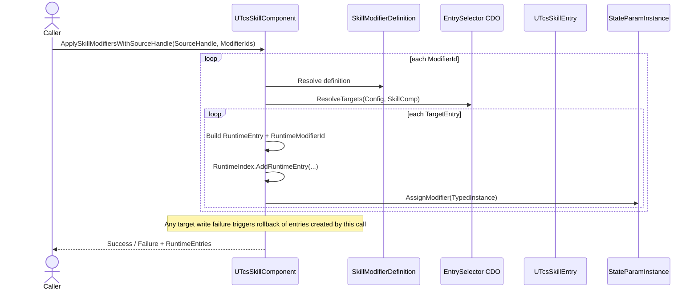
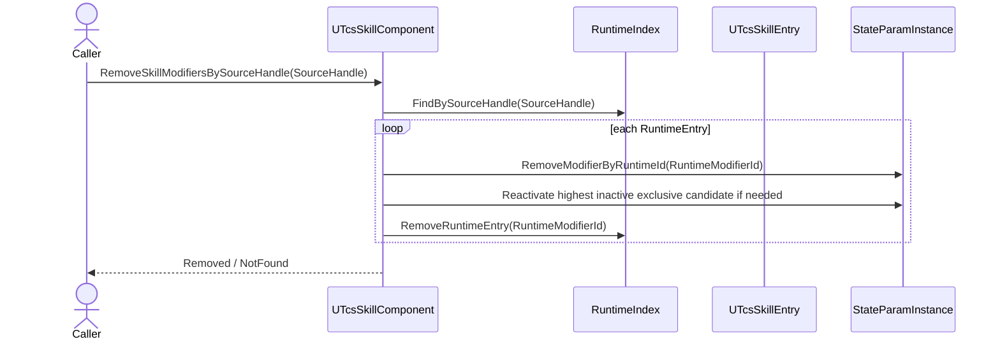
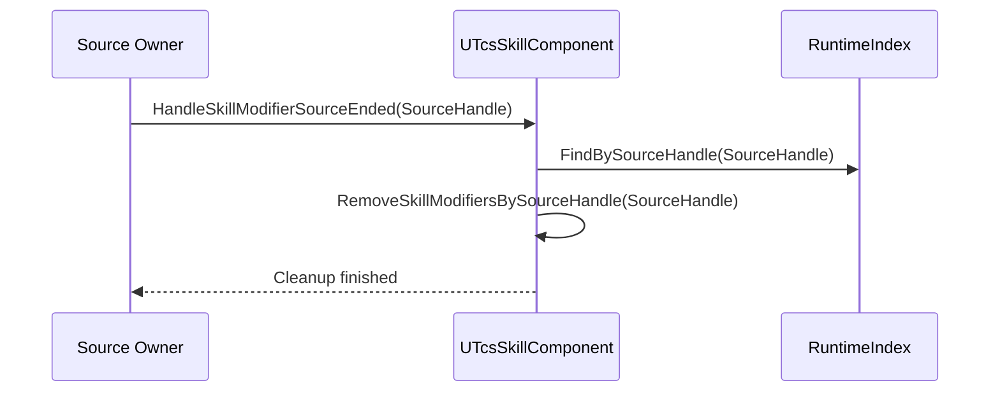
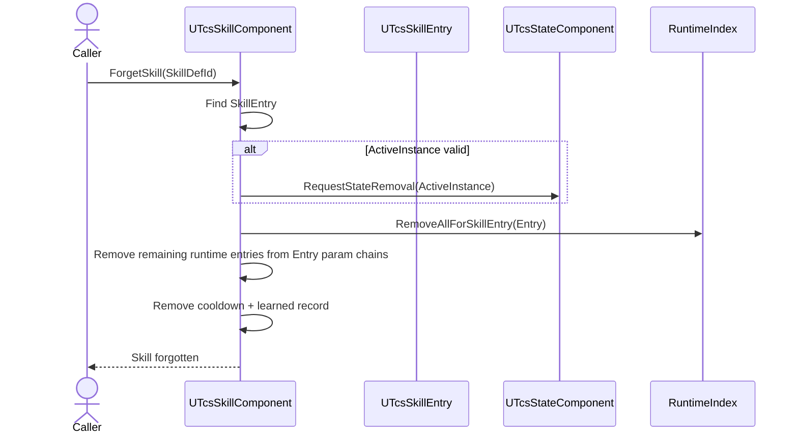
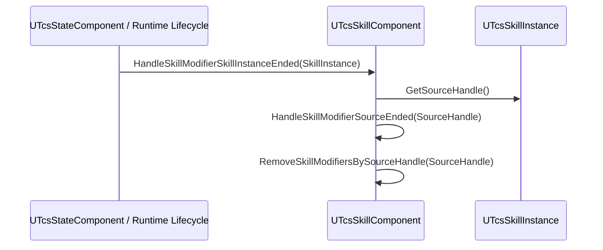

## 背景

TCS 当前的 Skill 系统已经完成了 `SkillEntry` / `SkillInstance` 的职责拆分，也已经把 Skill 参数实例的读取路径收敛到“`SkillInstance` 透传 `SkillEntry` 容器”这一方向上。与此同时，SkillModifier 侧只完成了定义资产、选择器和 typed 执行器，但没有真正落地一套可持续维护的运行时管理链。

如果继续让 SkillModifier 停留在“有声明、有底层 struct、但没有账本与入口面”的状态，后续无论从 Buff、装备、天赋、StateTree 节点还是蓝图接口接入，都会迅速出现以下问题：
- 不同调用面各自写 `SkillEntry.StateParamInstances`，没有统一清理与回滚。
- 来源结束时无法批量移除，或者只能全表扫描，时序和性能都很差。
- Exclusive 恢复、调试查询、跨技能批量移除都找不到权威源。

## 目标 / 非目标

- 目标：
  - 为 SkillModifier 建立完整的运行时权威账本、查询、移除与清理模型。
  - 保持 `SkillInstance -> SkillEntry` 的单容器读取模型，不新增第二套参数宿主。
  - 让不同来源都能复用同一套 SkillModifier 管理链。
  - 让 C++ / Blueprint / StateTree 共用同一套 SkillModifier 组件入口面。

- 非目标：
  - 不重做 `UTcsSkillModifierDefinition` 的 typed evaluator authoring 结构。
  - 不引入“`SkillInstance` 独立参数容器”或“Entry / Instance 双目标作用域”模型。
  - 不把 `Snapshot` 扩展成“冻结 Modifier 链”的复合语义。
  - 不在本提案中补 `AttributeModifier` 式的 OperandBinding / 外部参数覆盖 `EvaluatorConfig` 机制；本提案先建立稳定的管理与消费底盘。

## 决策

- 决策：`UTcsSkillComponent` 作为唯一权威账本宿主
  - SkillModifier 的“原始运行时记录”不挂在 `SkillEntry` 上，也不挂在 `SkillInstance` 上。
  - `UTcsSkillComponent` 统一负责登记、索引、查询、移除、恢复和自动清理。
  - `SkillEntry` 只承担“被写入的参数实例容器”职责，不兼任权威源。

- 决策：SkillModifier 的唯一生效容器是 `SkillEntry.StateParamInstances`
  - 所有 SkillModifier 最终都直接写入目标 `UTcsSkillEntry` 的 typed 参数实例链。
  - `UTcsSkillInstance` 继续通过现有透传访问器读取 `SkillEntry` 中的值，不新增独立 target scope。
  - 来源存活期间写入的临时 modifier，对所有读取该 `SkillEntry` 的地方都可见。

- 决策：不引入额外的“来源生命周期”字段，也不区分“目标作用域”
  - 本提案不为 SkillModifier 额外声明来源保留期枚举字段。
  - 所有 runtime entry 只绑定 `SourceHandle`；什么时候清理由来源本身的结束时机决定。
  - 无论来源持续多久，最终写入点都是 `SkillEntry` 的参数实例。
  - 如果未来真的出现“同一来源需要两种不同保留期”的业务，再单独起 proposal，而不是现在先加冗余字段。

- 决策：`Snapshot` 只冻结 Evaluator 重求值，不冻结 Modifier 链
  - `bIsSnapshot` 的职责继续限定在“是否允许 Evaluator 重新求值”。
  - SkillModifier 仍然可以在参数实例已 snapshot 的前提下增删改 modifier 链。
  - 如果未来需要“完全只读参数”，应另起独立策略语义，不与 snapshot 混用。

- 决策：新增统一运行时记录 `FTcsSkillModifierRuntimeEntry`
  - 它是 `UTcsSkillComponent` 账本层的权威记录，而不是底层求值链记录。
  - 它表示的是 selector 展开后的单条落地记录，而不是“一次 apply 请求”或一个 batch 容器。
  - 单个 `ModifierId` 在一次 apply 中，经过 `EntrySelector` 后可能生成 `0..N` 条 `FTcsSkillModifierRuntimeEntry`。
  - 每条 `FTcsSkillModifierRuntimeEntry` 只对应一个具体 `TargetSkillEntry` 和一个具体目标参数，不承载“多个目标”的聚合语义。
  - 它至少需要承载：运行时唯一 ID、`ModifierId`、Definition 引用、目标 Entry、目标 ParamTag、类型、`SourceHandle`、`Priority`、`MergePolicy`、已解析的 evaluator 与 config、激活状态。
  - 真正写进参数实例链的仍然是现有 `FStateParamNumericModifierInstance` / `Bool` / `Vector`，因为底层 `GetModifiedValue()` 已经围绕这些结构工作。

- 决策：新增索引聚合结构 `FTcsSkillModifierRuntimeIndex`
  - `UTcsSkillComponent` 不直接散落维护 4 组索引，而是由独立索引结构体统一封装增删改查逻辑。
  - 该结构至少管理以下索引：
    - `RuntimeModifierId -> RuntimeEntry`
    - `SourceHandle.Id -> RuntimeModifierId[]`
    - `TargetEntry -> RuntimeModifierId[]`
	- `(ModifierId + TargetEntry) -> RuntimeModifierId[]`
  - 这不是过度设计，而是为了把批量移除、互斥恢复、调试查询与 `ForgetSkill` 清理收拢到一个稳定边界内。

- 决策：Apply 时直接写透，Remove 时直接回收
  - Apply 流程：Definition/Selector 解析目标 Entry → 创建 `FTcsSkillModifierRuntimeEntry` → 写入索引聚合结构 → 转换成 typed modifier instance → 直接调用目标参数实例的 `AssignModifier()`。
  - Remove 流程：先通过索引找到账本记录 → 定位目标 `SkillEntry` 和参数实例 → 从对应 `ModifierInstances` 删除 → 触发 Exclusive 恢复 → 再清理账本和索引。
  - 不引入“组件投影层”或“延迟同步层”；组件管账本，参数实例管求值。

- 决策：StateTree / Blueprint / C++ 共用一套组件入口面
  - `UTcsSkillComponent` 应提供 SkillModifier 的统一组件 API。
  - StateTree 任务只负责组装入参和附带 `SourceHandle`，不直接手写 `SkillEntry` 容器。
  - Blueprint 和 C++ 直调入口也应走同一套核心逻辑，避免不同调用面再次各写各的。

## 运行时结构草案

### `FTcsSkillModifierRuntimeEntry`

建议新增一个账本层运行时记录结构 `FTcsSkillModifierRuntimeEntry`，作为 `UTcsSkillComponent` 的权威记录，而不是直接把底层 typed modifier instance 当成唯一源。

这里必须明确它的语义边界：
- 它是“展开后的单条落地记录”，不是“一次 `ApplySkillModifiersWithSourceHandle()` 请求对象”。
- `ById` 这类 selector 可能只产出 0 或 1 条记录，但 `ByGameplayTag`、`All` 这类 selector 完全可能在一次 apply 中产出多条记录。
- 因此，当一个 `ModifierId` 命中多个 `SkillEntry` 时，系统应生成多条 `FTcsSkillModifierRuntimeEntry`，每条分别指向自己的 `TargetSkillEntry`。
- 本提案不额外引入 `Request` / `Batch` / `Group` 级运行时对象；组件公开 API 返回的 `OutRuntimeEntries` 就是这些展开后的平铺结果。

建议字段：
- `int32 RuntimeModifierId`
- `FName ModifierId`
- `TWeakObjectPtr<UTcsSkillModifierDefinition> Definition`
- `TWeakObjectPtr<UTcsSkillEntry> TargetSkillEntry`
- `FGameplayTag TargetParamTag`
- `ETcsStateParameterType TargetParamType`
- `FTcsSourceHandle SourceHandle`
- `int32 Priority`
- `ETcsSkillModifierMergePolicy MergePolicy`
- `bool bActive`
- `TObjectPtr<UObject> ResolvedEvaluator`
- `FInstancedStruct ResolvedConfig`

其中：
- `RuntimeModifierId` 是账本层唯一主键，由 `UTcsSkillComponent` 通过单调递增计数器生成。
- `ResolvedEvaluator + ResolvedConfig` 代表已经从 Definition 解析完成、可直接落到底层 typed modifier instance 的执行信息。
- `SourceHandle` 是唯一生命周期锚点；账本层不再额外复制一份来源保留期枚举。
- `TargetSkillEntry + TargetParamTag + TargetParamType` 共同描述一条 runtime entry 的唯一目标落点；如果 selector 命中多个目标，就必须拆成多条记录，而不是在一条 entry 里塞数组。

### typed `FStateParam*ModifierInstance` 的必要扩展

虽然本提案保留现有 `FStateParamNumericModifierInstance` / `Bool` / `Vector` 作为底层求值链，但它们目前只带有 `ModifierId + SourceHandle`，这不足以支撑精确移除、失败回滚和同源重复应用场景。

因此建议把以下扩展视为本提案的一部分：
- 为三类 typed modifier instance 都新增 `RuntimeModifierId`
- 为三类参数实例都新增按 `RuntimeModifierId` 精确移除的 helper
- `RemoveModifiersBySourceHandle` 继续保留，用于批量路径；但内部应尽量复用“按 runtime id 精确移除 + Exclusive 恢复”的公共实现

如果不加这一层，下面两种场景会直接变脏：
- 同一个 `SourceHandle` 对同一目标参数重复应用多个同类 SkillModifier 时，无法只撤销其中一部分
- `ApplySkillModifiersWithSourceHandle` 在一半成功后一半失败时，无法做精确 rollback

### `FTcsSkillModifierRuntimeIndex`

你刚才提出的建议是正确的：4 组索引不应该散在 `UTcsSkillComponent` 里，而应收进一个索引聚合结构，例如 `FTcsSkillModifierRuntimeIndex`。

建议它内部至少维护：
- `TMap<int32, FTcsSkillModifierRuntimeEntry> RuntimeEntriesById`
- `TMap<int32, TArray<int32>> RuntimeIdsBySourceHandleId`
- `TMap<TWeakObjectPtr<UTcsSkillEntry>, TArray<int32>> RuntimeIdsByTargetEntry`
- `TMap<FTcsSkillModifierConflictKey, TArray<int32>> RuntimeIdsByConflictKey`

其中 `FTcsSkillModifierConflictKey` 由以下二元组组成：
- `ModifierId`
- `TargetSkillEntry`

这里不再额外纳入 `TargetParamTag`，因为当前契约下一个 `SkillModifierDef` 只修改一个确定参数；同一 `ModifierId` 不应对应多个不同目标参数。

建议 `FTcsSkillModifierRuntimeIndex` 统一提供这些方法：
- `bool AddRuntimeEntry(const FTcsSkillModifierRuntimeEntry& Entry)`
- `bool RemoveRuntimeEntry(int32 RuntimeModifierId, FTcsSkillModifierRuntimeEntry* OutRemoved = nullptr)`
- `void FindBySourceHandle(const FTcsSourceHandle& SourceHandle, TArray<const FTcsSkillModifierRuntimeEntry*>& OutEntries) const`
- `void FindBySkillEntry(UTcsSkillEntry* SkillEntry, TArray<const FTcsSkillModifierRuntimeEntry*>& OutEntries) const`
- `void FindConflictSet(const FTcsSkillModifierConflictKey& Key, TArray<const FTcsSkillModifierRuntimeEntry*>& OutEntries) const`
- `void RemoveAllForSkillEntry(UTcsSkillEntry* SkillEntry, TArray<FTcsSkillModifierRuntimeEntry>& OutRemovedEntries)`
- `void Reset()`

这个聚合结构的职责是“把账本和索引收干净”，不是自己直接改 `SkillEntry` 参数链；真正的写链 / 删链仍然由 `UTcsSkillComponent` 驱动。

## API 名称草案

下面这些名字是为了让实现阶段有稳定锚点；它们不是最终一字不改的硬约束，但当前 proposal 建议按这组名字靠拢，以保持和 `AttributeComponent` 现有风格一致。

### `UTcsSkillComponent` 公开入口

- `bool ApplySkillModifiersWithSourceHandle(const FTcsSourceHandle& SourceHandle, const TArray<FName>& ModifierIds, TArray<FTcsSkillModifierRuntimeEntry>& OutRuntimeEntries);`
- `bool RemoveSkillModifiersBySourceHandle(const FTcsSourceHandle& SourceHandle);`
- `bool GetSkillModifiersBySourceHandle(const FTcsSourceHandle& SourceHandle, TArray<FTcsSkillModifierRuntimeEntry>& OutRuntimeEntries) const;`
- `bool GetSkillModifiersBySkillEntry(UTcsSkillEntry* SkillEntry, TArray<FTcsSkillModifierRuntimeEntry>& OutRuntimeEntries) const;`

说明：
- 公开入口面优先围绕“来源”和“目标 SkillEntry”两种查询维度展开。
- `OutRuntimeEntries` 返回的是本次调用成功展开并落账本的平铺结果；单个 `ModifierId` 可能贡献 0..N 条 entry。
- 暂不建议把“按 runtime id 逐个删”做成 Blueprint 一等入口；那更像内部工具或调试面。

### `UTcsSkillComponent` 内部 / 受保护 helper

- `bool CreateSkillModifierRuntimeEntries(FName ModifierId, const FTcsSourceHandle& SourceHandle, TArray<FTcsSkillModifierRuntimeEntry>& OutRuntimeEntries);`
- `bool ApplySkillModifierRuntimeEntries(UPARAM(ref) TArray<FTcsSkillModifierRuntimeEntry>& RuntimeEntries);`
- `bool WriteRuntimeEntryToSkillEntry(FTcsSkillModifierRuntimeEntry& RuntimeEntry);`
- `bool RemoveRuntimeEntryFromSkillEntry(const FTcsSkillModifierRuntimeEntry& RuntimeEntry);`
- `void RemoveSkillModifierRuntimeEntriesByIds(const TArray<int32>& RuntimeModifierIds);`
- `void RemoveSkillModifiersForSkillEntry(UTcsSkillEntry* SkillEntry);`
- `void HandleSkillModifierSourceEnded(const FTcsSourceHandle& SourceHandle);`
- `void HandleSkillModifierSkillInstanceEnded(UTcsSkillInstance* SkillInstance);`

说明：
- `Create...` 负责“Definition + Selector -> 0..N 条账本记录草案”
- `Apply...` 负责真正落账本、落参数链、处理 rollback
- `Handle...Ended` 负责把外部生命周期钩子翻译成统一清理入口

## 生命周期时序

### 1. Apply 时序

设计目标：单次 apply 调用必须尽量接近事务语义。一次调用中如果部分 target 写入失败，应 rollback 这次调用已经成功写入的 runtime entry，而不是留下半脏状态。

建议步骤：
1. 调用方传入 `SourceHandle + ModifierIds`
2. 组件逐个解析 `UTcsSkillModifierDefinition`
3. 通过 `EntrySelector` 找到 `0..N` 个目标 `SkillEntry`
4. 为每个目标分别创建一条 `FTcsSkillModifierRuntimeEntry`
5. 先写入 `RuntimeIndex`
6. 再转换为 typed `FStateParam*ModifierInstance`，调用目标参数实例的 `AssignModifier()`
7. 任意一个 target 写链失败，则移除本次调用新增的全部 runtime id，并回滚已写入的参数链

### 2. Remove 时序（显式按来源移除）

建议步骤：
1. 先由索引结构找出该 `SourceHandle` 对应的全部 runtime entry
2. 按目标 `SkillEntry + TargetParamTag` 分组删除，避免重复定位参数实例
3. 每次删除都通过 `RuntimeModifierId` 精确命中底层链
4. 如果命中的 modifier 属于 `Exclusive` 组，则重新激活该组剩余的最高优先级候选
5. 参数链删除完成后，再清理账本索引

### 3. 来源结束时序

这里的“来源结束”指的是装备卸下、Buff 结束、外部效果失效等情况，不一定是技能实例结束。

设计要点：
- 来源结束不是特殊路径，它只是 `RemoveSkillModifiersBySourceHandle()` 的生命周期包装器
- 外部系统不应复制移除逻辑，只应把 `SourceHandle` 生命周期结束信号交给 `UTcsSkillComponent`

### 4. `ForgetSkill` 时序

建议步骤：
1. 找到目标 `SkillEntry`
2. 如果有活跃实例，先请求运行时状态移除，让该实例来源走正常清理
3. 然后调用 `RemoveSkillModifiersForSkillEntry(Entry)` 清掉所有仍然挂在该 learned skill 上的剩余 SkillModifier
4. 最后再移除冷却跟踪、`LearnedSkills` 记录和对象本身

这里故意把“清 SkillModifier”放在移除 `LearnedSkills` 之前，避免先删宿主再补清理导致的悬挂弱引用问题。

### 5. 实例结束时序

设计要点：
- 实例结束本质上是“来源结束”的特化包装器
- 它不单独发明清理算法，而是复用 `SourceHandle` 路径
- 如果未来某些短时来源不是 `UTcsSkillInstance` 本身产生的，也仍然可以复用同一套 `SourceHandle` 生命周期模型

## 风险 / 取舍

- 风险：某些只应短时存在的来源直接写入 `SkillEntry`，会让临时 modifier 对所有 `SkillEntry` 读取者可见。
  - 取舍：这是本提案明确接受的行为，用来避免双容器与隔离层复杂度。
  - 缓解：把 `SourceHandle` 清理、调试查询和批量移除做扎实；如果未来需要隔离，再由后续 proposal 扩展。

- 风险：组件账本和参数实例链会形成“双重存在”。
  - 取舍：组件账本负责管理，参数实例链负责求值，这两层职责不同，不能强行合并成一层。
  - 缓解：通过 `FTcsSkillModifierRuntimeIndex` 统一账本与索引逻辑，避免管理层再次扩散。

- 风险：如果继续允许任何调用面直接写 `SkillEntry.StateParamInstances`，账本会与实际生效状态失同步。
  - 缓解：proposal 明确禁止手写容器，所有公开调用面必须经过 `UTcsSkillComponent`。

- 风险：未来如果要支持外部参数覆盖 `EvaluatorConfig`，当前账本记录结构可能需要扩展。
  - 缓解：本提案保留 `ResolvedConfig` 槽位，但不在本次实现 operand-binding 风格的额外输入语义。

## 迁移计划

1. 在 `UTcsSkillComponent` 下引入 SkillModifier 权威账本与索引结构。
2. 为组件新增统一的 SkillModifier 应用 / 查询 / 移除核心入口。
3. 将 SkillModifier 写入路径收敛到 `SkillEntry` 的 typed 参数实例链。
4. 补齐 StateTree / Blueprint / C++ 三类入口面，并统一 `SourceHandle` 清理语义。
5. 覆盖 `ForgetSkill`、来源结束、实例取消/结束等生命周期清理场景。

## 开放问题

- 当前不引入 OperandBinding / 外部参数覆盖 `EvaluatorConfig` 机制；若后续确认需要，可在账本结构稳定后新增独立提案。